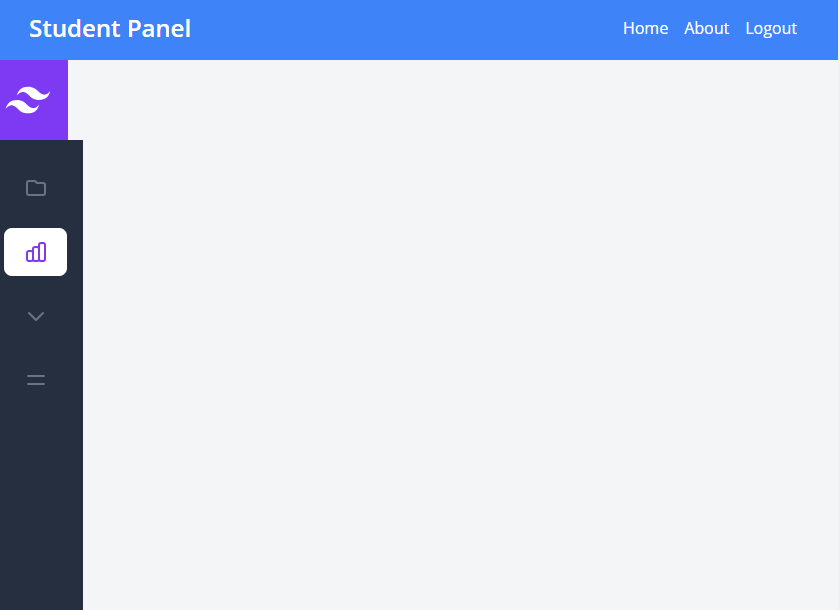

# Django Student and Teacher Registration API

## Description

A Django API for student and teacher registration, student login, teacher login, error handling for non-existing users, student dashboard, and teacher dashboard.

## Features

- Student registration
- Student login
- Teacher login
- Error handling for non-existing users
- Student dashboard
- Teacher dashboard

# Screenshots

## Registration Form Student
 student registration form


## Registration from Teacher

 Teacher Registration form


## Error Handling with Django TO REACT JS
 Error handle with Django 


## Error Handling For Teache Form

 Error handle with Django 


## Login page 
 Login Student 
 


## Teacher Dashbord After login 
 After login Teacher Dashbord
 

## Student Dashbord After login 
 After login Student Dashbord
 

## Requirements

- Python 3.x
- Django
- Django REST framework
- Database (e.g., PostgreSQL, SQLite)
- Additional dependencies (specify if any)


 # Usage
   Access the admin panel at http://localhost:8000/admin/ to manage users and data.
   Use the provided API endpoints to perform student and teacher registration and login

## API Endpoints

 Student Registration: /api/student/
 Student Login: /api/student/login/
 Teacher Login: /get_login/

 Error handling for non-existing users: Appropriate responses from login endpoints when a user is not found.
 Include any additional API endpoints and details here.


## Installation

1. Clone the repository:

   ```bash
   git clone https://github.com/your/repo.git
   cd your-project-directory
     
   python -m venv venv

   python manage.py migrate
  
   python manage.py createsuperuser
   
   python manage.py runserver

# For React js

 - Node.js and NPM (Node Package Manager)
   Download All Packege from package.json 
   npm install run command 
   npm start